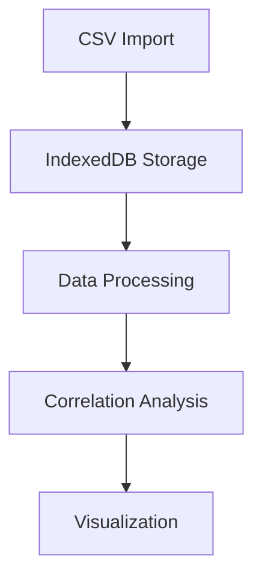

# 🔬 Personal Health Analytics Platform

A powerful web application for analyzing correlations between health markers, diet, and lifestyle factors.

## 📊 Technical Overview

### Architecture
The application is built with:
- ⚛️ React + TypeScript
- 📦 Vite for bundling
- 🗄️ IndexedDB for local storage
- 📈 Recharts for visualization
- 🎨 Tailwind CSS + shadcn/ui for styling

### Core Components
| Component | Purpose | Key Files |
|-----------|---------|-----------|
| `App.tsx` | Main application logic, state management | `src/App.tsx` |
| `DataImport` | CSV data import handling | `src/components/DataImport.tsx` |
| `VariableManager` | Variable definition & management | `src/components/VariableManager.tsx` |
| `Statistics` | Correlation calculations | `src/lib/utils/statistics.ts` |

### Data Flow


### Key Data Structures
```typescript
// Health Data Structure
interface HealthData {
  date: string;
  [key: string]: string | number;
}

// Variable Definition
interface Variable {
  name: string;
  type: VariableType;
  unit: string;
  normalRange?: {
    min: number;
    max: number;
  };
  description?: string;
  active: boolean;
}
```

## 🚀 Developer Guide

### State Management
The application uses React's useState for state management:
- `data`: Stores imported health data
- `variables`: Manages variable definitions
- `correlations`: Holds calculated correlations

### Database Operations
IndexedDB operations are abstracted through the `useIndexedDB` hook:
```typescript
const {
  saveData,
  loadData,
  saveVariable,
  loadVariables
} = useIndexedDB();
```

### Statistical Calculations
Correlation calculations are performed in `statistics.ts`:
- Pearson correlation coefficient
- P-value calculation
- Significance filtering (p < 0.05)

## 📖 User Guide

### Importing Data
1. Prepare CSV file with:
   - First column: Date (YYYY-MM-DD)
   - Subsequent columns: Variable values

2. Use the Data Import component:
   ```csv
   date,weight,steps,sleep_hours
   2024-01-01,70.5,8000,7.5
   2024-01-02,70.2,10000,8
   ```

### Managing Variables
1. Add new variables through the Variable Manager:
   - Name (required)
   - Type (blood/diet/supplement/lifestyle/sleep/exercise)
   - Unit
   - Normal range (optional)
   - Description (optional)

2. Variables can be:
   - Toggled active/inactive
   - Used in correlation analysis
   - Visualized in charts

### Analyzing Correlations
The platform automatically:
- Calculates correlations between all active variables
- Filters for statistical significance (p < 0.05)
- Displays results in sortable table
- Shows time-series visualization for strongest correlations

## 🔧 Technical Details

### Performance Considerations
- Correlation calculations optimized for datasets with:
  - Up to 100 variables
  - Up to 1000 data points per variable
- IndexedDB used for efficient data storage
- Memoized calculations where appropriate

### Error Handling
- CSV validation
- Data type checking
- Missing value handling
- User feedback through toast notifications

### Data Processing Pipeline
1. Data Import
   - CSV parsing
   - Data validation
   - Type conversion
2. Storage
   - IndexedDB write
   - Variable registration
3. Analysis
   - Correlation calculation
   - Statistical significance testing
4. Visualization
   - Data transformation
   - Chart rendering

## 🎯 Implementation Status

| Feature | Status | Notes |
|---------|--------|-------|
| CSV Import | ✅ | Complete |
| Variable Management | ✅ | Complete |
| Basic Correlations | ✅ | Complete |
| Time Series Viz | ✅ | Complete |
| Scatter Plots | ❌ | Planned |
| Export | ❌ | Planned |
| Lagged Correlations | ❌ | Planned |
| Statistical Summaries | ❌ | Planned |
